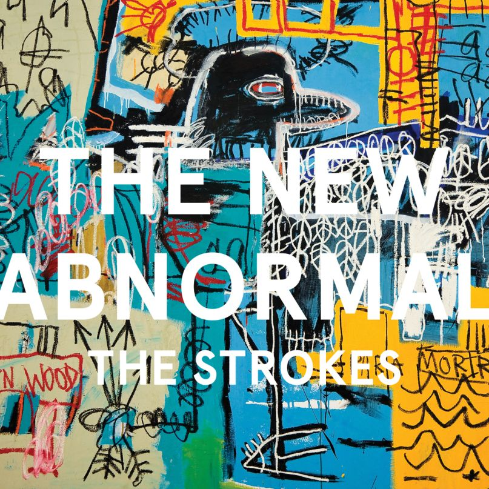

# Hi, I'm Gabriel Kinshuk
___
## 🔧 Tools & Technologies
- **Python**: NumPy, Pandas, Matplotlib, Scikit-learn, Seaborn
- **R**: ggplot2, randomForest, tidymodels
- **SQL**
- **Java**, **C++**
___
## 🧠 Currently learning
* PyTorch, TensorFlow, SQL
___
## 🚧 I’m currently working on  
* Writing a compiler from *The Elements of Computing Systems: Building a Modern Computer from First Principles*
* Finishing a few courses on Object-Oriented Design and Machine Learning
___
## 📚 Currently reading
* *Foundation Mathematics for Computer Science* by John Vince  
* *Reinforcement Learning for Finance* by Samit Ahlawat
___
## 🌱 Hobbies
* 🧩 Cryptic crosswords  
* 🪵 Woodworking
  * Crafting furniture and saving costs
* 🧵 Sustainable fashion
  * Thrifting, upcycling, and buying consciously
___
<!-- ## 📜 Check out my recent thoughts:
* [Blog post 1](#)
* [Blog post 2](#)

___ -->
## 💿 I'd love to talk about my albums of the month
* Amoroso - João Gilberto

* The New Abnormal - The Strokes

