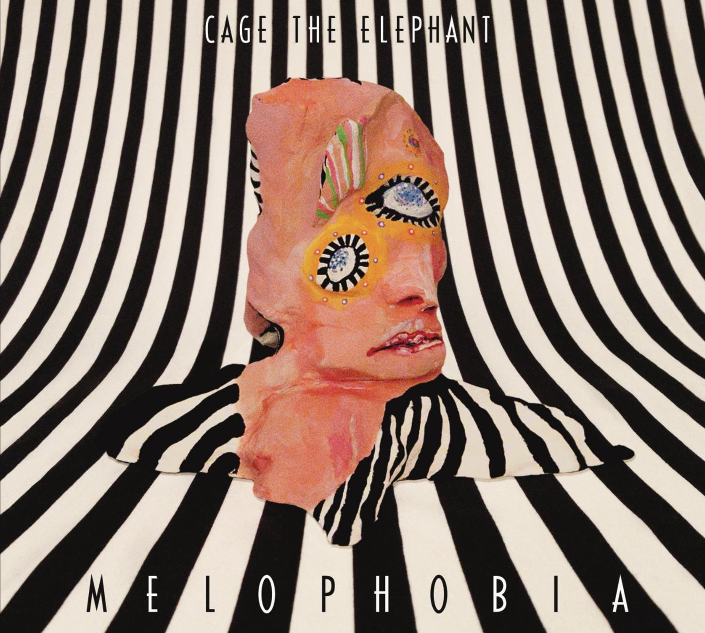

# Hi, I'm Gabriel Kinshuk
___
## 🔧 Tools & Technologies
- **Python**: NumPy, Pandas, Matplotlib, Scikit-learn, Seaborn, GurobiPy
- **R**: ggplot2, randomForest, tidymodels
- **SQL**
- **Java**, **C++**
___
## 🧠 Currently learning
* **Frameworks & tools**: Advanced SQL  
* **In-person courses**: Unsupervised Learning, Time-Series Analysis, Generative AI

___
## 🚧 I’m currently working on
* Working through *Data Science in R: A Gentle Introduction*, a recommended preparatory textbook for my upcoming Masters in Business Analytics
* Working on the Deep Learning specialization by Andrew Ng
* Finishing online specializations in Finance and Quantitative Modeling as well as Data Science
___
## 📚 Currently reading
* *Real Mathematical Analysis* by Charles Pugh
* *Reinforcement Learning for Finance* by Samit Ahlawat
___
## 🌱 Hobbies
* 🧩 Cryptic crosswords  
* 🪵 Woodworking
  * Crafting furniture and saving costs
* 🧵 Sustainable fashion
  * Thrifting, upcycling, and buying consciously
* 💿 Discovering new music
  * Albums I have on repeat this month  
  <table>
  <tr>
    <td></td>
    <td>
      <b>Tako Tsubo</b> - L'Impératrice 
      <i>Nu Disco</i>
    </td>
  </tr>
  <tr>
    <td></td>
    <td>
      <b>Melophobia</b> - Cage The Elepahnt 
      <i>Alternative Rock</i>
    </td>
  </tr>
</table>

<!-- ## 📜 Check out my recent thoughts:
* [Blog post 1](#)
* [Blog post 2](#)

___ -->
